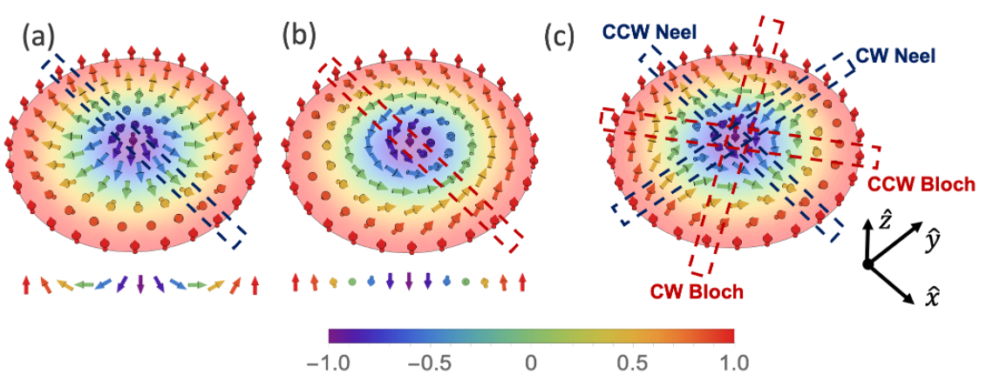
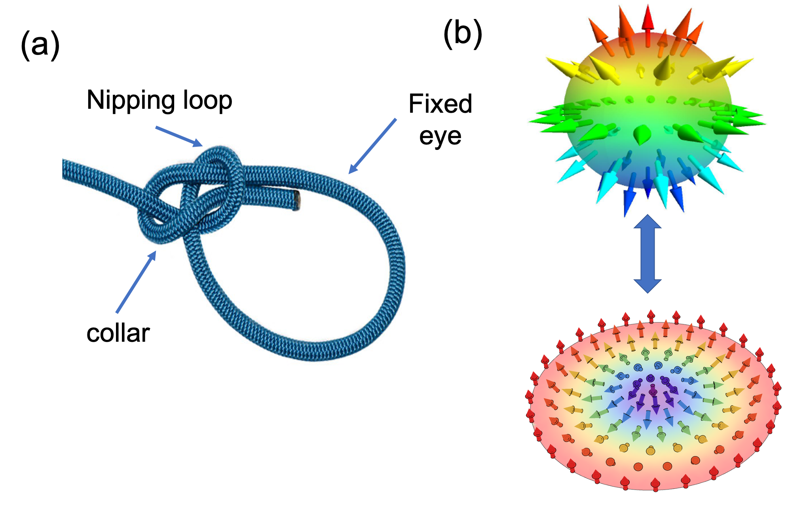

 # Topological Hall Effect (THE) in a Skyrmion crystal (SkX)

 **Table of contents**

 1. [What is a skyrmion ?]
 1.
 1.

 ## What is a skyrmion ?

 

  A magnetic skyrmion is a small swirling pattern in the magnetization texture (aka spin texture). In pioneering literature they have been refered to as magnetic vortices or vortex like configurations. It is a type of highly metastable soliton or a defect. This concept is an analog adopted from the nuclear physics idea proposed by the British nuclear physicist Tony Skyrme. He proposed this idea in 1960's for the theoretical treatment of interactions between the fundamental particles like the poins. Then this idea evolved and the skyrmion is understood as a particle like excitation in its corresponding field. In condensed matter systems, this field is the array of magnetic moments. The key feature that differentiates a magnetic skyrmion from anyother type of magnetic solitons like the magnetic bubbles, merons etc., is that the centre magnetic moment and the moments on the outer edges of a skyrmions are pointed opposite to each other and parallel to the normal direction of the plane of their existance.

  
   
  <em>Figure 1: Anatomy of Skyrmions andWinding numbers. (a) Neel type skyrmion. Cross section
along any radial direction is a CCW Neel domain wall. (b) Bloch skyrmion. Cross section along
any direction is a CCW Neel domain wall. (c) Anti-skyrmion, showing different domain wall type cross sections along different radial directions. Alternates between Neel and Bloch walls with CW and CCW rotation of
spins, depending on the skyrmions.</em>

### Topology of a skyrmion

 

  Soliton nature of a magnetic skyrmion is associated with its non-trivial real space topology. The quantity that describes the topolgy is the topological charge or the winding number (aka topological quantum number). This topological charge differentiates skyrmions from the trivial collinear magnetic states (i.e, ferro, antiferro, ferri magnetic states). Skyrmions have a winding number $$ \pm 1 $$ while the collinear texutres have zero topological charge. Non trivial topology is like a knot making a loop in a rope and to untie the loop one must use the extremities of the rope to undo the knot. Otherwise one must cut the rope to free it. So a free rope and the one with a loop are not topologically equivalent. So a continuous transformation of 2 topologically different objects is not possible. In an ideal infinite magnetic system the configurations are said to be topologically equivalent if there exists a continuous transformation between them without having to overcome an infinite energy barrier. Skyrmions and the collinear magnetic states belong to different topological genus. This offers a stability to Skyrmions. In reality, the magnetic systems are discrete and hence the energy barrier is not infinity but very large value. This is the reason for the skyrmion states being a metastable one.

  
   
  <em>Figure 2: Non trivial topology. (a) Bowline knot, simple example of a non trivial topology. (b)
Stereographic mapping of the Neel type skyrmion onto a 2-Sphere S2.</em>

